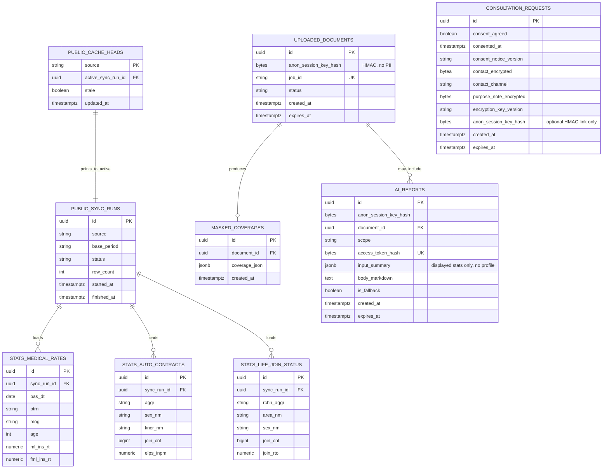

# ERD — 모두의 보험 (Insurance For All)

**버전:** MVP 1.5 (2026-08-21) — **비영속·토큰·메타데이터 보안 보강**
**근거:** [PRD.md](./PRD.md) · [FUNCTIONAL_SPEC.md](./FUNCTIONAL_SPEC.md) · [PUBLIC_API_PAGE_PLAN.md](./PUBLIC_API_PAGE_PLAN.md) · [ENVIRONMENT.md](./ENVIRONMENT.md)
**DB:** PostgreSQL 17.11 = **공공 캐시·(선택) PDF/AI 산출물·상담(동의 후)** 만  

---

## 0. 원칙 정정 (중요)

### 0.1 사용자가 지적한 설계 원칙

> **P0 사용자 입력은 생년월일·성별·지역으로 제한하고, 화면에 쓰기 위해 받을 뿐 PostgreSQL에 저장하지 않는다. 직업·유병력은 수집하지 않는다.**

이 원칙이 제품 약속(이름·연락처·주민번호 없이 탐색, 최소 수집)과 맞다.  
v1.2–1.3 ERD의 `session_profiles`에 `birth_date` 등을 둔 것은 **이 원칙을 깨뜨린 잘못된 확장**이다.

### 0.2 문서와의 관계 (정직하게)

| 자료 | 원래 적힌 것 | 이번에 맞추는 해석 |
|------|--------------|-------------------|
| PRD §11 `UserProfile` | 비영속 논리 모델 | **영구 PG 테이블이 아님.** 브라우저 메모리/`sessionStorage`의 프로필 |
| F-02 익명 키 | 선택적 세션 연결 | **서버가 발급하는 불투명 핸들**만 쿠키에 허용. 프로필 인코딩·PG 컬럼 금지 |
| PUBLIC_API_PAGE_PLAN | birthDate 전달 | **POST JSON 요청에서 계산 후 재사용·저장·로그 금지, 요청 종료 시 참조 해제.** URL·PG 보관 금지 |

**PostgreSQL에 넣어도 되는 것**

- 공공 OpenAPI 캐시 (`stats_*`, sync, heads) — 개인 아님  
- (선택) PDF job·마스킹 JSON — 증권 내용, 프로필 아님  
- (선택) AI 리포트 본문 — 통계 요약 기반, **생년월일 원문 금지**  
- 상담 요청 — **동의 후에만** 연락처·선택 메모 암호화

**PostgreSQL에 넣지 않는 것**

- 생년월일, 성별, 지역
- 직업·유병력은 P0에서 아예 수집하지 않음
- 보험나이·연령대 (매 요청 `asOfDate`로 계산)
- 운영자 계정·비밀번호 (환경변수만. `admins` 테이블 없음)

### 0.3 런타임 모델 (프로필)

```text
[브라우저]
  입력 → 메모리/sessionStorage
        ↓ POST JSON으로 프로필 전달 (URL query 금지)
[FastAPI]
  birth_date + asOfDate → insuranceAge → API 어댑터 → 재사용·저장·로그 금지
        ↓
  PG: public_cache_heads → stats_* 만 조회
        ↓
  응답 후 서버는 프로필을 PG에 INSERT 하지 않음
```

P0는 프로필에 브라우저 메모리/`sessionStorage`만 사용한다. Redis에는 프로필을 두지 않으며 P1+에서도 별도 개인정보 검토 없이 도입하지 않는다. HttpOnly `ifa_anon`은 프로필을 담지 않는 선택 산출물 접근용 난수 쿠키로, 30분 비활성 기준으로 갱신되고 프로필 초기화 시 만료된다.

---

## 1. 논리 개요 (v1.5)

```text
【비영속】 UserProfile (브라우저 메모리/sessionStorage)
          birth_date, sex, area_nm
                 │ POST JSON 요청마다 전달 · 계산 후 폐기 · PG 미저장
                 ▼
【PostgreSQL】
  public_cache_heads → public_sync_runs
                     → stats_medical_rates | stats_auto_contracts | stats_life_join_status

  uploaded_documents ── masked_coverages     (선택 PDF, anon_session_key_hash만)
  ai_reports                                 (scope, 통계 요약 JSON · 원문 토큰 없음)
  consultation_requests                      (동의 후 연락처·메모 암호화)
```

| PRD 개념 | 구현 |
|----------|------|
| SessionProfile | **PG 테이블 삭제.** 브라우저 메모리/`sessionStorage`; 쿠키에는 불투명 익명 키만 |
| PublicStatsCache | `public_cache_heads` + `public_sync_runs` + `stats_*` |
| UploadedDocument / MaskedCoverage / AiReport / Consultation | PG (아래). 프로필 FK 없음 |

---

## 2. Mermaid



※ 다이어그램에 **UserProfile 테이블 없음** = 의도적.

---

## 3. ERDCloud · 관계

| 부모 | 자식 | 관계 |
|------|------|------|
| public_cache_heads | public_sync_runs | N:1 (active) |
| public_sync_runs | stats_* | 1:N |
| uploaded_documents | masked_coverages | 1:0..1 |
| uploaded_documents | ai_reports | 0..1:N |

**없음:** `session_profiles`, 프로필 → 통계 FK, 생년월일 컬럼, 운영자 계정 테이블.

익명 세션 원문 토큰은 32바이트 이상 난수이며 **안에 나이·성별을 인코딩하지 않는다.** `HttpOnly`·`SameSite=Lax` 쿠키에만 두고 HTTPS에서 `Secure`를 적용한다. 수명은 30분 비활성이며 성공한 `/api/v1` 응답에서 갱신하고 프로필 초기화 시 만료한다. PostgreSQL에는 `HMAC-SHA-256(SESSION_TOKEN_PEPPER, token)`인 `anon_session_key_hash`만 저장한다.
운영 세션 `ifa_ops`는 `ADMIN_SESSION_PEPPER` HMAC이며 JWT가 아니다. PG에 운영 계정을 두지 않는다. 다건 PDF job은 운영 쿠키 HMAC을 `anon_session_key_hash`에 묶어 사용자 `ifa_anon`과 분리한다.
리포트 접근 토큰은 32바이트 이상 난수로 발급해 응답에서 한 번만 제공한다. URL·브라우저 저장소에 넣지 않고 조회 요청의 `Authorization` 헤더로만 받는다. PostgreSQL에는 서버 측 pepper를 키로 한 HMAC-SHA-256만 저장하고 조회 시 상수 시간 비교를 사용한다.
업로드 원본 파일명은 개인정보를 포함할 수 있으므로 저장하지 않는다.
`expires_at`은 애플리케이션 설정으로 생성하고 주기 작업이 관련 행을 hard delete한다. MVP 기본은 문서·마스킹 결과 24시간, AI 리포트 7일, 상담 요청 30일이며 공개 전 실제 처리 목적과 법률 검토에 맞춰 확정하고 동의문과 함께 변경한다. 문서 결과의 24시간 보관 상한은 쿠키의 30분 비활성 수명과 별개이고, 쿠키가 만료되면 남은 보관기간에도 조회할 수 없다.

---

## 4. PostgreSQL DDL (프로필 테이블 없음)

```sql
-- MVP schema v1.5 — 사용자 입력·원문 토큰·원본 파일명은 PG에 저장하지 않음

CREATE TABLE public_sync_runs (
  id            UUID PRIMARY KEY,
  source        VARCHAR(16) NOT NULL CHECK (source IN ('medical', 'auto', 'life')),
  base_period   VARCHAR(16) NOT NULL,
  status        VARCHAR(16) NOT NULL CHECK (status IN ('success', 'failed')),
  row_count     INT,
  started_at    TIMESTAMPTZ NOT NULL,
  finished_at   TIMESTAMPTZ,
  error_code              VARCHAR(64),
  error_message_sanitized TEXT  -- serviceKey, URL query, 응답 원문 금지
);

CREATE TABLE public_cache_heads (
  source              VARCHAR(16) PRIMARY KEY
                      CHECK (source IN ('medical', 'auto', 'life')),
  active_sync_run_id  UUID NOT NULL REFERENCES public_sync_runs(id),
  stale               BOOLEAN NOT NULL DEFAULT FALSE,
  updated_at          TIMESTAMPTZ NOT NULL DEFAULT now()
);

CREATE TABLE stats_medical_rates (
  id           UUID PRIMARY KEY,
  sync_run_id  UUID NOT NULL REFERENCES public_sync_runs(id),
  bas_dt       DATE NOT NULL,
  cmpy_cd      VARCHAR(50),
  cmpy_nm      VARCHAR(200),
  ptrn         VARCHAR(150),
  mog          VARCHAR(100),
  prd_nm       VARCHAR(600),
  age          INT NOT NULL,
  ml_ins_rt    NUMERIC(18,2),
  fml_ins_rt   NUMERIC(18,2),
  ofr_inst_nm  VARCHAR(200),
  fetched_at   TIMESTAMPTZ NOT NULL DEFAULT now(),
  UNIQUE (sync_run_id, bas_dt, cmpy_cd, ptrn, mog, prd_nm, age)
);

CREATE TABLE stats_auto_contracts (
  id                UUID PRIMARY KEY,
  sync_run_id       UUID NOT NULL REFERENCES public_sync_runs(id),
  isu_cmpy_ofr_ym   VARCHAR(6) NOT NULL,
  isu_itms_nm       VARCHAR(32) NOT NULL,
  mog_clsf_nm       VARCHAR(64),
  sex_nm            VARCHAR(8) NOT NULL,
  aggr              VARCHAR(32) NOT NULL,
  atmb_plor_nm      VARCHAR(16),
  kncr_nm           VARCHAR(32),
  join_cnt          BIGINT,
  elps_inpm         NUMERIC(20,0),
  fetched_at        TIMESTAMPTZ NOT NULL DEFAULT now(),
  UNIQUE (sync_run_id, isu_cmpy_ofr_ym, isu_itms_nm, mog_clsf_nm,
          sex_nm, aggr, atmb_plor_nm, kncr_nm)
);

CREATE TABLE stats_life_join_status (
  id                   UUID PRIMARY KEY,
  sync_run_id          UUID NOT NULL REFERENCES public_sync_runs(id),
  stts_accml_trgt_yr   VARCHAR(4) NOT NULL,
  area_nm              VARCHAR(32) NOT NULL,
  sex_nm               VARCHAR(8) NOT NULL,
  rchn_aggr            VARCHAR(32) NOT NULL,
  isu_kind_nm          VARCHAR(32) NOT NULL,
  join_cnt             BIGINT,
  join_rto             NUMERIC(8,2),
  fetched_at           TIMESTAMPTZ NOT NULL DEFAULT now(),
  UNIQUE (sync_run_id, stts_accml_trgt_yr, area_nm, sex_nm, rchn_aggr, isu_kind_nm)
);

-- 선택 경로: PDF / AI (프로필 컬럼 없음)
CREATE TABLE uploaded_documents (
  id                 UUID PRIMARY KEY,
  anon_session_key_hash BYTEA NOT NULL
                        CHECK (octet_length(anon_session_key_hash) = 32),
  job_id             VARCHAR(64) NOT NULL UNIQUE,
  status             VARCHAR(32) NOT NULL,
  byte_size          INT,
  page_count         INT,
  created_at         TIMESTAMPTZ NOT NULL DEFAULT now(),
  expires_at         TIMESTAMPTZ NOT NULL,
  fail_code          VARCHAR(64)
);

CREATE TABLE masked_coverages (
  id               UUID PRIMARY KEY,
  document_id      UUID NOT NULL UNIQUE REFERENCES uploaded_documents(id) ON DELETE CASCADE,
  coverage_json    JSONB NOT NULL,
  preview_masked   TEXT,
  created_at       TIMESTAMPTZ NOT NULL DEFAULT now()
);

CREATE TABLE ai_reports (
  id                UUID PRIMARY KEY,
  anon_session_key_hash BYTEA NOT NULL
                        CHECK (octet_length(anon_session_key_hash) = 32),
  document_id       UUID REFERENCES uploaded_documents(id) ON DELETE SET NULL,
  scope             VARCHAR(16) NOT NULL CHECK (scope IN ('health', 'auto', 'life')),
  access_token_hash BYTEA NOT NULL UNIQUE
                    CHECK (octet_length(access_token_hash) = 32),
  input_summary     JSONB NOT NULL,  -- 화면 표시 통계만. 세션 프로필 넣지 말 것
  body_markdown     TEXT NOT NULL,
  is_fallback       BOOLEAN NOT NULL DEFAULT FALSE,
  created_at        TIMESTAMPTZ NOT NULL DEFAULT now(),
  expires_at        TIMESTAMPTZ NOT NULL
);

-- 유일한 "사용자 연락" 영속: 동의 후
CREATE TABLE consultation_requests (
  id                  UUID PRIMARY KEY,
  consent_agreed      BOOLEAN NOT NULL CHECK (consent_agreed),
  consented_at        TIMESTAMPTZ NOT NULL,
  consent_notice_version VARCHAR(32) NOT NULL,
  -- AES-256-GCM: nonce||ciphertext||tag 를 한 BYTEA에 저장 (별도 nonce 컬럼 없음)
  contact_encrypted   BYTEA NOT NULL,
  -- P0 UI·API: contact_channel='email' 만. 'phone'은 P1+ 예약 (DDL CHECK는 확장용 유지)
  contact_channel     VARCHAR(16) NOT NULL
                      CHECK (contact_channel IN ('phone', 'email')),
  purpose_note_encrypted BYTEA,  -- 동일 포맷, 미입력 시 NULL
  encryption_key_version VARCHAR(32) NOT NULL,
  anon_session_key_hash BYTEA
                        CHECK (anon_session_key_hash IS NULL OR octet_length(anon_session_key_hash) = 32),
  created_at          TIMESTAMPTZ NOT NULL DEFAULT now(),
  expires_at          TIMESTAMPTZ NOT NULL
);

CREATE INDEX ix_uploaded_documents_session_job
  ON uploaded_documents (anon_session_key_hash, job_id);
CREATE INDEX ix_uploaded_documents_expires_at
  ON uploaded_documents (expires_at);
CREATE INDEX ix_ai_reports_expires_at
  ON ai_reports (expires_at);
CREATE INDEX ix_consultation_requests_expires_at
  ON consultation_requests (expires_at);
```

---

## 5. API 입출력 함의

| 엔드포인트 | 프로필 | PG |
|------------|--------|-----|
| `POST /stats/*` | JSON body에서 읽어 보험나이 계산 후 생년월일 재사용·저장·로그 금지, 요청 종료 시 참조 해제 | `stats_*`만 SELECT |
| `POST /reports` | 통계 요약만 LLM에. 생년월일 전달 금지. `report_id`와 토큰을 한 번 반환 | `ai_reports` (요약 JSON) |
| `GET /reports/{report_id}` | 토큰은 URL이 아닌 `Authorization` 헤더로 전달 | HMAC 조회·상수 시간 검증, `Cache-Control: no-store` |
| `POST /consultations` | 목적·항목·보유기간·거부권 고지에 동의한 뒤 **이메일**(P0 `contact_channel=email`)·선택 메모 | AES-256-GCM(AEAD) 암호화 후 만료시각과 함께 INSERT · 운영 알림 메일 |

---

## 6. 변경 이력

| 버전 | 내용 |
|------|------|
| 1.3 | 파생 나이 컬럼 제거, cache_heads |
| **1.4** | **`session_profiles` PG 제거.** 사용자 입력 비영속 원칙 복원 |
| **1.5** | 원본 파일명 제거, 접근 토큰 HMAC, 오류 로그 정제, 상담 메모 암호화, 동의 버전·만료 삭제 필드 |

---

## 7. Mermaid / ERDCloud

- Mermaid: §2  
- ERDCloud: 공공 캐시 5종 + (선택) documents/masked/ai/consultation. **세션프로필 엔티티 만들지 말 것.**  
