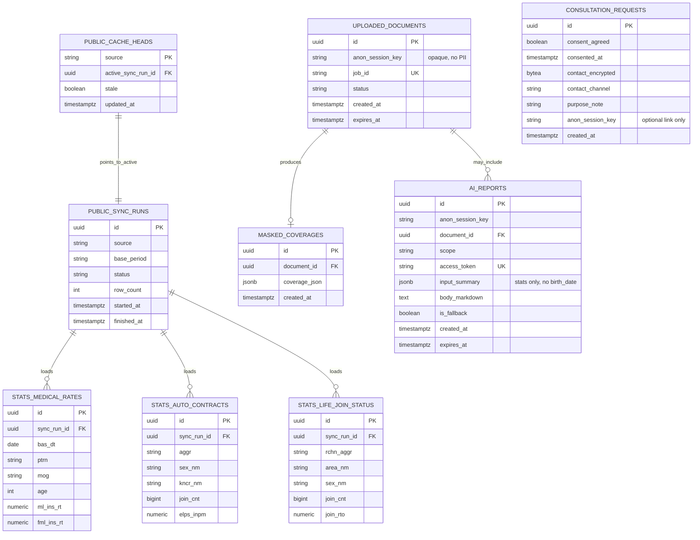

# ERD — 모두의 보험 (Insurance For All)

**버전:** MVP 1.4 (2026-08-20) — **사용자 입력 비영속(PG 미저장) 원칙 복원**  
**근거:** [PRD.md](./PRD.md) · [FUNCTIONAL_SPEC.md](./FUNCTIONAL_SPEC.md) · [PUBLIC_API_PAGE_PLAN.md](./PUBLIC_API_PAGE_PLAN.md)  
**DB:** PostgreSQL 17.11 = **공공 캐시·(선택) PDF/AI 산출물·상담(동의 후)** 만  

---

## 0. 원칙 정정 (중요)

### 0.1 사용자가 지적한 설계 원칙

> **사용자의 입력 정보(생년월일·성별·지역·직업·유병력 등)는 화면에 쓰기 위해 받을 뿐, PostgreSQL에 저장하지 않는다.**

이 원칙이 제품 약속(이름·연락처·주민번호 없이 탐색, 최소 수집)과 맞다.  
v1.2–1.3 ERD의 `session_profiles`에 `birth_date` 등을 둔 것은 **이 원칙을 깨뜨린 잘못된 확장**이다.

### 0.2 문서와의 관계 (정직하게)

| 자료 | 원래 적힌 것 | 이번에 맞추는 해석 |
|------|--------------|-------------------|
| PRD §11 `SessionProfile` | 논리 엔티티로 “익명 세션” 언급 | **영구 PG 테이블이 아님.** 요청·쿠키·단기 메모리上的 프로필 |
| F-02 `session_id` | 출력에 session_id | **서버가 발급하는 익명 핸들**(쿠키/Redis TTL). 프로필 컬럼을 PG에 두지 않음 |
| PUBLIC_API_PAGE_PLAN | birthDate 등 “보관” 표현 | **클라이언트/서명 쿠키에만.** PG 보관 금지로 수정 |

**PostgreSQL에 넣어도 되는 것**

- 공공 OpenAPI 캐시 (`stats_*`, sync, heads) — 개인 아님  
- (선택) PDF job·마스킹 JSON — 증권 내용, 프로필 아님  
- (선택) AI 리포트 본문 — 통계 요약 기반, **생년월일 원문 금지**  
- 상담 요청 — **동의 후에만** 연락처  

**PostgreSQL에 넣지 않는 것**

- 생년월일 / 주민번호 앞자리  
- 성별, 지역, 직업, 유병력  
- 보험나이·연령대 (매 요청 `asOfDate`로 계산)

### 0.3 런타임 모델 (프로필)

```text
[브라우저]
  입력 → 메모리/sessionStorage 또는 서명된 쿠키(암호화 권장)
        ↓ 매 API 요청에 프로필 전달 (또는 쿠키 복호화)
[FastAPI]
  birth_date + asOfDate → insuranceAge → API 어댑터
        ↓
  PG: public_cache_heads → stats_* 만 조회
        ↓
  응답 후 서버는 프로필을 PG에 INSERT 하지 않음
```

선택: Redis에 `anon_session:{id}` TTL 30분 — **만료 삭제**, 백업·분석용 PG 이관 금지.  
MVP는 **쿠키/클라이언트만**으로도 충분.

---

## 1. 논리 개요 (v1.4)

```text
【비영속】 UserProfile (클라이언트/쿠키/Redis TTL)
          birth_date, sex, area_nm, job?, health?
                 │ 요청마다 전달 · PG 미저장
                 ▼
【PostgreSQL】
  public_cache_heads → public_sync_runs → stats_medical | stats_auto | stats_life

  uploaded_documents ── masked_coverages     (선택 PDF, anon_session_key만)
  ai_reports                                 (scope, 통계 요약 JSON · 생년월일 없음)
  consultation_requests                      (동의 후 연락처만)
```

| PRD 개념 | 구현 |
|----------|------|
| SessionProfile | **PG 테이블 삭제.** 요청 컨텍스트 / 쿠키 |
| PublicStatsCache | `public_cache_heads` + `public_sync_runs` + `stats_*` |
| UploadedDocument / MaskedCoverage / AiReport / Consultation | PG (아래). 프로필 FK 없음 |

---

## 2. Mermaid



※ 다이어그램에 **UserProfile 테이블 없음** = 의도적.

---

## 3. ERDCloud · 관계

| 부모 | 자식 | 관계 |
|------|------|------|
| public_cache_heads | public_sync_runs | N:1 (active) |
| public_sync_runs | stats_* | 1:N |
| uploaded_documents | masked_coverages | 1:0..1 |
| uploaded_documents | ai_reports | 0..1:N |

**없음:** `session_profiles`, 프로필 → 통계 FK, 생년월일 컬럼.

`anon_session_key`: 랜덤 UUID/토큰. **안에 나이·성별 인코딩 금지.**

---

## 4. PostgreSQL DDL (프로필 테이블 없음)

```sql
-- MVP schema v1.4 — 사용자 입력은 PG에 저장하지 않음

CREATE TABLE public_sync_runs (
  id            UUID PRIMARY KEY,
  source        VARCHAR(16) NOT NULL CHECK (source IN ('medical', 'auto', 'life')),
  base_period   VARCHAR(16) NOT NULL,
  status        VARCHAR(16) NOT NULL CHECK (status IN ('success', 'failed')),
  row_count     INT,
  started_at    TIMESTAMPTZ NOT NULL,
  finished_at   TIMESTAMPTZ,
  error_message TEXT
);

CREATE TABLE public_cache_heads (
  source              VARCHAR(16) PRIMARY KEY
                      CHECK (source IN ('medical', 'auto', 'life')),
  active_sync_run_id  UUID NOT NULL REFERENCES public_sync_runs(id),
  stale               BOOLEAN NOT NULL DEFAULT FALSE,
  updated_at          TIMESTAMPTZ NOT NULL DEFAULT now()
);

CREATE TABLE stats_medical_rates (
  id           UUID PRIMARY KEY,
  sync_run_id  UUID NOT NULL REFERENCES public_sync_runs(id),
  bas_dt       DATE NOT NULL,
  cmpy_cd      VARCHAR(50),
  cmpy_nm      VARCHAR(200),
  ptrn         VARCHAR(150),
  mog          VARCHAR(100),
  prd_nm       VARCHAR(600),
  age          INT NOT NULL,
  ml_ins_rt    NUMERIC(18,2),
  fml_ins_rt   NUMERIC(18,2),
  ofr_inst_nm  VARCHAR(200),
  fetched_at   TIMESTAMPTZ NOT NULL DEFAULT now(),
  UNIQUE (sync_run_id, bas_dt, cmpy_cd, ptrn, mog, prd_nm, age)
);

CREATE TABLE stats_auto_contracts (
  id                UUID PRIMARY KEY,
  sync_run_id       UUID NOT NULL REFERENCES public_sync_runs(id),
  isu_cmpy_ofr_ym   VARCHAR(6) NOT NULL,
  isu_itms_nm       VARCHAR(32) NOT NULL,
  mog_clsf_nm       VARCHAR(64),
  sex_nm            VARCHAR(8) NOT NULL,
  aggr              VARCHAR(32) NOT NULL,
  atmb_plor_nm      VARCHAR(16),
  kncr_nm           VARCHAR(32),
  join_cnt          BIGINT,
  elps_inpm         NUMERIC(20,0),
  fetched_at        TIMESTAMPTZ NOT NULL DEFAULT now(),
  UNIQUE (sync_run_id, isu_cmpy_ofr_ym, isu_itms_nm, mog_clsf_nm,
          sex_nm, aggr, atmb_plor_nm, kncr_nm)
);

CREATE TABLE stats_life_join_status (
  id                   UUID PRIMARY KEY,
  sync_run_id          UUID NOT NULL REFERENCES public_sync_runs(id),
  stts_accml_trgt_yr   VARCHAR(4) NOT NULL,
  area_nm              VARCHAR(32) NOT NULL,
  sex_nm               VARCHAR(8) NOT NULL,
  rchn_aggr            VARCHAR(32) NOT NULL,
  isu_kind_nm          VARCHAR(32) NOT NULL,
  join_cnt             BIGINT,
  join_rto             NUMERIC(8,2),
  fetched_at           TIMESTAMPTZ NOT NULL DEFAULT now(),
  UNIQUE (sync_run_id, stts_accml_trgt_yr, area_nm, sex_nm, rchn_aggr, isu_kind_nm)
);

-- 선택 경로: PDF / AI (프로필 컬럼 없음)
CREATE TABLE uploaded_documents (
  id                 UUID PRIMARY KEY,
  anon_session_key   VARCHAR(64) NOT NULL,
  job_id             VARCHAR(64) NOT NULL UNIQUE,
  status             VARCHAR(32) NOT NULL,
  original_filename  VARCHAR(255),
  byte_size          INT,
  page_count         INT,
  created_at         TIMESTAMPTZ NOT NULL DEFAULT now(),
  expires_at         TIMESTAMPTZ,
  fail_reason        TEXT
);

CREATE TABLE masked_coverages (
  id               UUID PRIMARY KEY,
  document_id      UUID NOT NULL UNIQUE REFERENCES uploaded_documents(id),
  coverage_json    JSONB NOT NULL,
  preview_masked   TEXT,
  created_at       TIMESTAMPTZ NOT NULL DEFAULT now()
);

CREATE TABLE ai_reports (
  id                UUID PRIMARY KEY,
  anon_session_key  VARCHAR(64) NOT NULL,
  document_id       UUID REFERENCES uploaded_documents(id),
  scope             VARCHAR(16) NOT NULL CHECK (scope IN ('health', 'auto', 'life')),
  access_token      VARCHAR(64) NOT NULL UNIQUE,
  input_summary     JSONB NOT NULL,  -- 통계 숫자만. birth_date/sex 원문 넣지 말 것
  body_markdown     TEXT NOT NULL,
  is_fallback       BOOLEAN NOT NULL DEFAULT FALSE,
  created_at        TIMESTAMPTZ NOT NULL DEFAULT now(),
  expires_at        TIMESTAMPTZ
);

-- 유일한 "사용자 연락" 영속: 동의 후
CREATE TABLE consultation_requests (
  id                  UUID PRIMARY KEY,
  consent_agreed      BOOLEAN NOT NULL,
  consented_at        TIMESTAMPTZ NOT NULL,
  contact_encrypted   BYTEA NOT NULL,
  contact_channel     VARCHAR(16) NOT NULL,
  purpose_note        VARCHAR(500),
  anon_session_key    VARCHAR(64),
  created_at          TIMESTAMPTZ NOT NULL DEFAULT now()
);
```

---

## 5. API 입출력 함의

| 엔드포인트 | 프로필 | PG |
|------------|--------|-----|
| `GET /stats/*` | 요청 body/쿼리 또는 쿠키에서 읽어 보험나이 계산 | `stats_*`만 SELECT |
| `POST /reports` | 통계 요약만 LLM에. 생년월일 전달 금지 | `ai_reports` (요약 JSON) |
| `POST /consultations` | 동의+연락처 | `consultation_requests` INSERT |

---

## 6. 변경 이력

| 버전 | 내용 |
|------|------|
| 1.3 | 파생 나이 컬럼 제거, cache_heads |
| **1.4** | **`session_profiles` PG 제거.** 사용자 입력 비영속 원칙 복원 |

---

## 7. Mermaid / ERDCloud

- Mermaid: §2  
- ERDCloud: 공공 캐시 5종 + (선택) documents/masked/ai/consultation. **세션프로필 엔티티 만들지 말 것.**  
