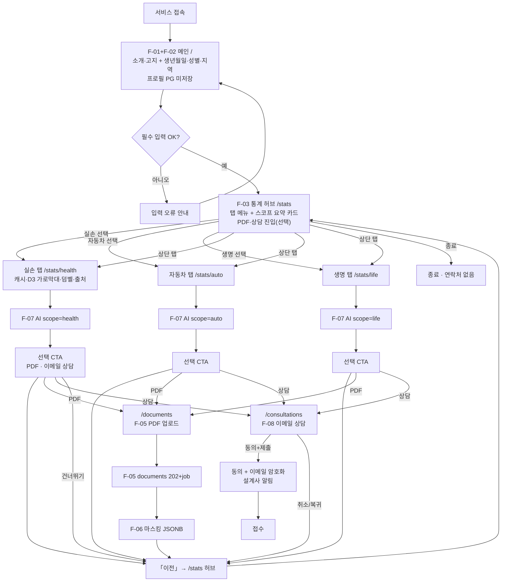
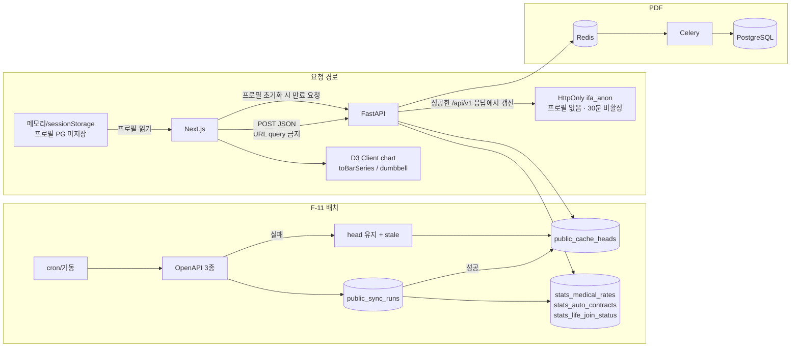
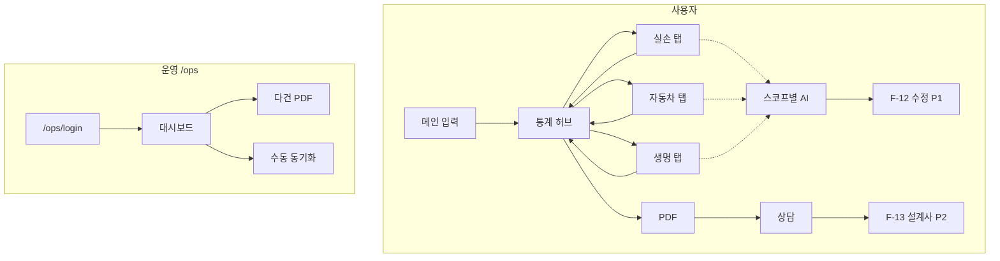

# Flowchart

**프로젝트:** 모두의 보험 (Insurance For All)  
**버전:** 2026-08-24 (MVP 1.4 — Tab 허브 여정 · 차트 유형)
**관련:** [PRD.md](./PRD.md) · [FUNCTIONAL_SPEC.md](./FUNCTIONAL_SPEC.md) · [PUBLIC_API_PAGE_PLAN.md](./PUBLIC_API_PAGE_PLAN.md) · [DESIGN.md](./DESIGN.md) · [ENVIRONMENT.md](./ENVIRONMENT.md)

- **1장:** P0 필수  
- **2장:** P1/P2 전체 (데모 범위 아님)

---

## 1. MVP 필수 Flow (P0)

포함: F-01~F-08, F-11.  
제외: 사용자 여정의 F-09·F-10(별 라우트 `/ops`), F-12, F-13.

규칙 요약:

- 입력 완료 후 **항상 허브** 랜딩. 스코프 순서 강제 없음.
- 상단 탭은 **허브 진입 후**(세션 프로필 있음)만 활성.
- 스코프 화면 **「이전」** = `/stats` 허브.
- 허브에 P0 AI 필수 아님. AI는 각 스코프 탭 하단만.
- **스코프 하단(AI 아래)** PDF·이메일 상담 CTA → `/documents`, `/consultations` 전용 페이지.
- P0 상담 UI는 **이메일만**. 통계 탐색 중 연락처 수집 없음.

### 1-2. P0 시스템

---

## 2. 이후 전체 Flow (P0 + P1 + P2)

### 2-2 ~ 2-3

관리자·파싱 수정·설계사 디렉터리 — 기존 P1/P2 취지 유지 (데모 제외).  
관리자(F-09·F-10)는 **`/ops` · `/ops/login`** 이며 사용자 `/` Header와 분리한다. 사용자 Sign In을 넣지 않는다. HMAC 쿠키 `ifa_ops`(JWT 아님). 상담 암호문 복호화 열람은 F-10. F-10a GA4는 선택 P0·**미구현**(허용 이벤트 목록 없음)이며 생년월일·연락처·토큰을 보내지 않는다. F-12·F-13은 P1/P2.

---

## 3. 화면 목록 (프로토타입)

| 화면 | MVP | 비고 |
|------|-----|------|
| 메인 (소개+입력) | F-01, F-02 | `/` |
| 통계 허브 | F-03 | `/stats` · 탭 선택·요약 |
| 실손 탭+비교+AI | F-03, F-04, F-07 | `/stats/health` · D3 |
| 자동차 탭+AI | F-03, F-07 | `/stats/auto` · D3 |
| 생명 탭+AI | F-03, F-07 | `/stats/life` · D3 |
| PDF 진행 | F-05, F-06 | 선택 · 허브/공통 하단 |
| 상담 | F-08 | 선택 |
| 관리자 | `/ops` | F-09, F-10. 로그인 `/ops/login` |

v0: **JavaScript only**, Next App Router, Tailwind, **D3.js** — [TECH_STACK.md](./TECH_STACK.md).
