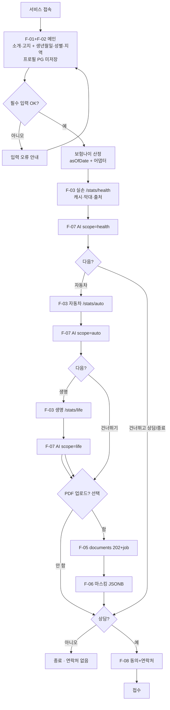
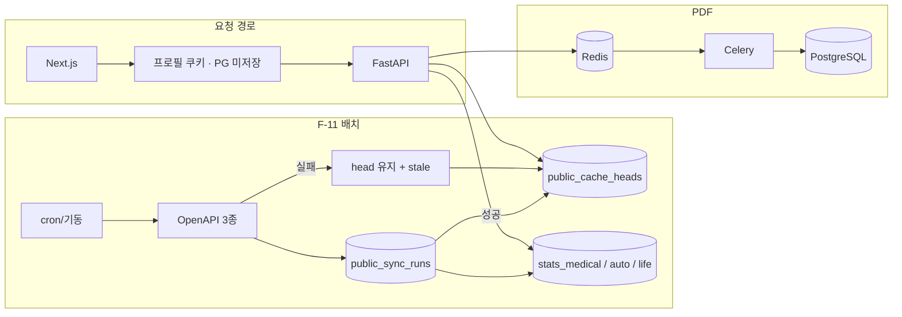
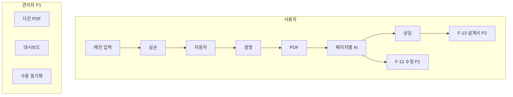

# Flowchart

**프로젝트:** 모두의 보험 (Insurance For All)  
**버전:** 2026-08-21 (MVP 1.2 여정)  
**관련:** [PRD.md](./PRD.md) · [FUNCTIONAL_SPEC.md](./FUNCTIONAL_SPEC.md) · [PUBLIC_API_PAGE_PLAN.md](./PUBLIC_API_PAGE_PLAN.md)

- **1장:** P0 필수  
- **2장:** P1/P2 전체 (데모 범위 아님)

---

## 1. MVP 필수 Flow (P0)

포함: F-01~F-08, F-11.  
제외: F-09, F-10 UI, F-12, F-13.

### 1-2. P0 시스템

---

## 2. 이후 전체 Flow (P0 + P1 + P2)

### 2-2 ~ 2-3

관리자·파싱 수정·설계사 디렉터리 — 기존 P1/P2 취지 유지 (데모 제외).

---

## 3. 화면 목록 (프로토타입)

| 화면 | MVP | 비고 |
|------|-----|------|
| 메인 (소개+입력) | F-01, F-02 | 생년월일·성별·지역 |
| 실손 통계+비교+AI | F-03, F-04, F-07 | |
| 자동차 통계+AI | F-03, F-07 | |
| 생명 통계+AI | F-03, F-07 | |
| PDF 진행 | F-05, F-06 | 선택 |
| 상담 | F-08 | |
| 관리자 | | P1 |

v0: **JavaScript only**, Next App Router, Tailwind — [TECH_STACK.md](./TECH_STACK.md).
